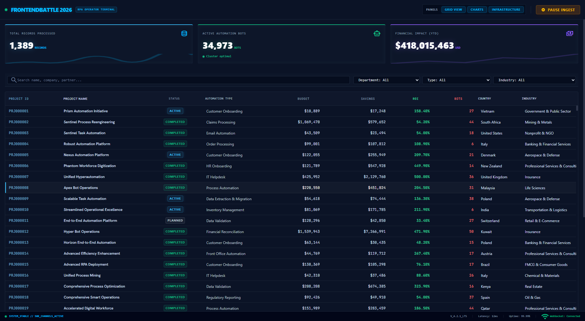

# FrontEndBattle 2026 — RPA Operator Control Terminal

**Live URL:** [https://kittyboy06.github.io/FB_R2/](https://kittyboy06.github.io/FB_R2/)

A high-density, real-time telemetry console built for the FrontEndBattle 2026 Hackathon (Round 2). This application displays and parses live telemetry data stream updates from a 50,000-row enterprise RPA database at 60 FPS with zero performance degradation.



## Core Architectural Guardrails (Zero-React Overhead)
To handle a continuous 200ms tick firehose stream over 50,000 entries, this application employs a hybrid state engine that bypasses React's virtual DOM diffing:
1. **Dumb React Shell**: React acts only as a static layout/mounting framework. It does **not** manage rows or KPI states, preventing global component re-renders.
2. **Direct DOM Mutations**: KPIs and grid cells are updated directly at the browser level (`textNode.textContent = value`).
3. **Fixed DOM Node recycling**: Custom virtualized grid viewport (`VirtualGrid`) recycles a fixed pool of **25 DOM row elements**, updating positioning via absolute CSS offsets.
4. **O(1) Ingestion lookup**: Uses a native ES6 `Map` instance to index rows by primary key for instant update merges.

---

## Key Features

- **Live KPIs Dashboard**: Direct-DOM counters displaying running totals of processed records, active robots, and cumulative USD savings.
- **High-Frequency Recycled Grid**: Custom-built viewport virtualization running at a locked 60 FPS under a 50k row load (no external grid libraries like ag-grid or react-window).
- **Buffer Ingest Control (Pause/Play)**: A FIFO buffering queue captures stream ticks during pauses and flushes them in-order synchronously when resumed.
- **Categorical Dropdown Filters**: Dynamically filters columns (Automation Type, Department, Industry) derived straight from the live database.
- **Multi-Field Fuzzy Search**: Out-of-order partial matching across all text-based fields debounced at 150ms.
- **Multi-Column Sorting**: Allows primary and Shift+click secondary/tertiary column sorting computed in <5ms.
- **Workspace layout persistence**: Hide/show console panels, automatically saved and restored from `localStorage`.
- **Soft visual alert animations**: Row flashing (crimson red for negative ROI, amber for Failed status) utilizing CSS keyframe animations.

---

## Tech Stack
- **Framework**: React 19 + Vite 8
- **Styles**: Tailwind CSS v4 + PostCSS
- **Unit Testing**: Vitest 3
- **Automation & Deployment**: Custom batch deploy script

---

## Getting Started

### 1. Installation
Clone the repository and install dependencies:
```bash
npm install
```

### 2. Run Local Development Server
Start the local development server:
```bash
npm run dev
```
Open `http://localhost:5173/FB_R2/` in your browser.

### 3. Run Automated Unit Tests
Execute the Vitest suite:
```bash
npm run test
```

### 4. Build Production Package
Build the application bundle into `/dist`:
```bash
npm run build
```

---

## Deployment
This project is configured to deploy to GitHub Pages.

To deploy manually:
```bash
npm run deploy
```

Alternatively, double-click the `deploy.bat` script in the root directory to automatically build and publish the latest build.
